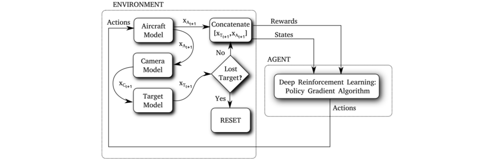

# Artificial Intelligence and Human Interaction

Combining supervised and reinforcement learning with human interaction modalities such as task demonstrations, eye gaze data, and natural language, to safely train autonomous systems.

## Human-in-the-loop Machine Learning

<center>
    
    <p style="font-size: 0.9rem;"><em>Cycle-of-Learning for Autonomous Systems from Human Interaction: a concept for combining multiple forms of human interaction with reinforcement learning. As the policy develops, the autonomy independence increases and the human interaction level decreases.</em></p>
</center>

- This research enables an agent to learn a single task in real-time from human interaction in the forms of demonstrations of the tasks, interventions and/or evaluations when the agent is performing it.

- Intervention-based learning guides the user to supervise and correct the agent in real-time whenever their policy fails, providing more informative samples and increasing sample-efficiency during the training period.

- Reinforcement learning component allows the agent to improve itself while interacting with the environment and surpassing human performance on the demonstrated tasks.

<center>
    
    <p style="font-size: 0.9rem;"><em>Performance comparison in terms of task completion and samples required with Interventions (Int), Demonstrations (Demo) and the Cycle-of-Learning (CoL) framework for (A) 4 human interactions, (B) 8 human interactions, (C) 12 human inter-actions and (D) 20 human interactions, respectively.</em></p>
</center>

<center>
    
    <p style="font-size: 0.9rem;"><em>Comparison of CoL, BC, DDPG, and DAPG for 3 random seeds in the dense- and sparse-reward LunarLanderContinuous-v2 environment, respectively.</em></p>
</center>


### Integrating Behavior Cloning and Reinforcement Learning for Improved Performance in Sparse Reward Environments
  - [Project page](https://viniciusguigo.github.io/cycle-of-learning/)
  - [Paper](https://arxiv.org/abs/1910.04281)
  - [Video](https://www.youtube.com/watch?v=AQwsk6kZfok)
  - [AAMAS20 Conference Presentation (video)](https://youtu.be/FiHyO2pIZhA)
  - Citation:
    ```
    @inproceedings{goecks2020integrating,
    author = {Goecks, Vinicius G. and Gremillion, Gregory M. and Lawhern, Vernon J. and Valasek, John and Waytowich, Nicholas R.},
    title = {Integrating Behavior Cloning and Reinforcement Learning for Improved Performance in Dense and Sparse Reward Environments},
    year = {2020},
    isbn = {9781450375184},
    publisher = {International Foundation for Autonomous Agents and Multiagent Systems},
    address = {Richland, SC},
    booktitle = {Proceedings of the 19th International Conference on Autonomous Agents and MultiAgent Systems},
    pages = {465–473},
    numpages = {9},
    keywords = {human-robot/agent interaction, machine learning for robotics, reinforcement learning, agent-based analysis of human interaction},
    location = {Auckland, New Zealand},
    series = {AAMAS ’20}
    }
    ```

### Efficiently Combining Human Demonstrations and Interventions for Safe Training of Autonomous Systems in Real-Time
  - [Video](https://www.youtube.com/watch?v=1aktQxW7GQE)
  - [Paper](https://arxiv.org/abs/1810.11545)
  - Citation:
    ```
    @inproceedings{goecks2019efficiently,
      title={Efficiently combining human demonstrations and interventions for safe training of autonomous systems in real-time},
      author={Goecks, Vinicius G and Gremillion, Gregory M and Lawhern, Vernon J and Valasek, John and Waytowich, Nicholas R},
      booktitle={Proceedings of the AAAI Conference on Artificial Intelligence},
      volume={33},
      pages={2462--2470},
      year={2019}
    }
    ```

### Cycle-of-Learning for Autonomous Systems from Human Interaction
  - [Paper](https://arxiv.org/abs/1808.09572)
  - Citation:
    ```
    @article{Waytowich2018,
      author    = {Nicholas R. Waytowich and
                   Vinicius G. Goecks and
                   Vernon J. Lawhern},
      title     = {Cycle-of-Learning for Autonomous Systems from Human Interaction},
      journal   = {CoRR},
      volume    = {abs/1808.09572},
      year      = {2018},
      url       = {http://arxiv.org/abs/1808.09572},
      archivePrefix = {arXiv},
      eprint    = {1808.09572},
      biburl    = {https://dblp.org/rec/bib/journals/corr/abs-1808-09572},
      bibsource = {dblp computer science bibliography, https://dblp.org}
    }
    ```

### Cyber-Human Approach For Learning Human Intention And Shape Robotic Behavior Based On Task Demonstration
  - [Paper](https://ieeexplore.ieee.org/document/8489595)

### PODNet: A Neural Network for Discovery of Plannable Options**
  - [Paper](https://arxiv.org/abs/1911.00171)

## Intelligent Motion Video Guidance for Unmanned Air System Ground Target Tracking


Reinforcement learning agent trained to control a real fixed-wing aircraft and perform video tracking of ground targets. 

- [Paper](https://arc.aiaa.org/doi/pdf/10.2514/6.2019-0137)
- [Video](https://youtu.be/isJtDdAiM3U)

## Morphing Wing

More information soon.