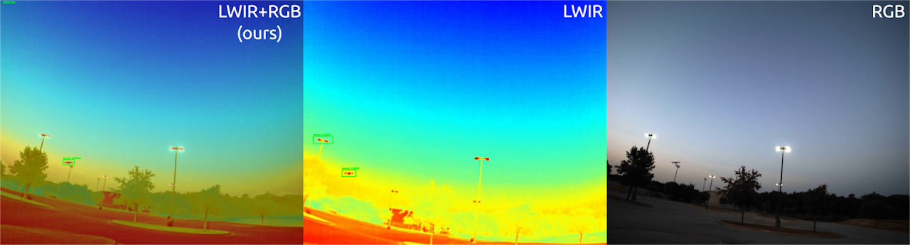

# Vision-based Counter-UAS

## Vision-based Detection of Unmanned Air Systems for Counter-UAS

This research was winner of the 2020 SPIE Automatic Target Recognition Best Student Paper Award. It combines data from RGB and long-wave infrared (LWIR) cameras to detect drones through previously difficult environments such as flying above and below the treeline/horizon, in the presence of birds, and glare from the sun. 

- **Combining Visible and Infrared Spectrum Imagery using Machine Learning for Small Unmanned Aerial System Detection**
  - [Project page](https://sites.google.com/view/tamudrone-spie2020/)
  - [Paper](https://www.spiedigitallibrary.org/conference-proceedings-of-spie/11394/2557442/Combining-visible-and-infrared-spectrum-imagery-using-machine-learning-for/10.1117/12.2557442.short)
  - [Paper (preprint)](https://arxiv.org/abs/2003.12638)
  - [News article](https://engineering.tamu.edu/news/2018/11/a-team-wins-md5-a-hack-of-the-drones-2018.html)