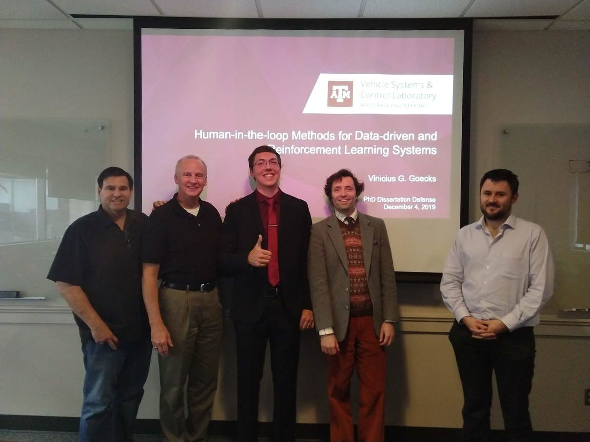
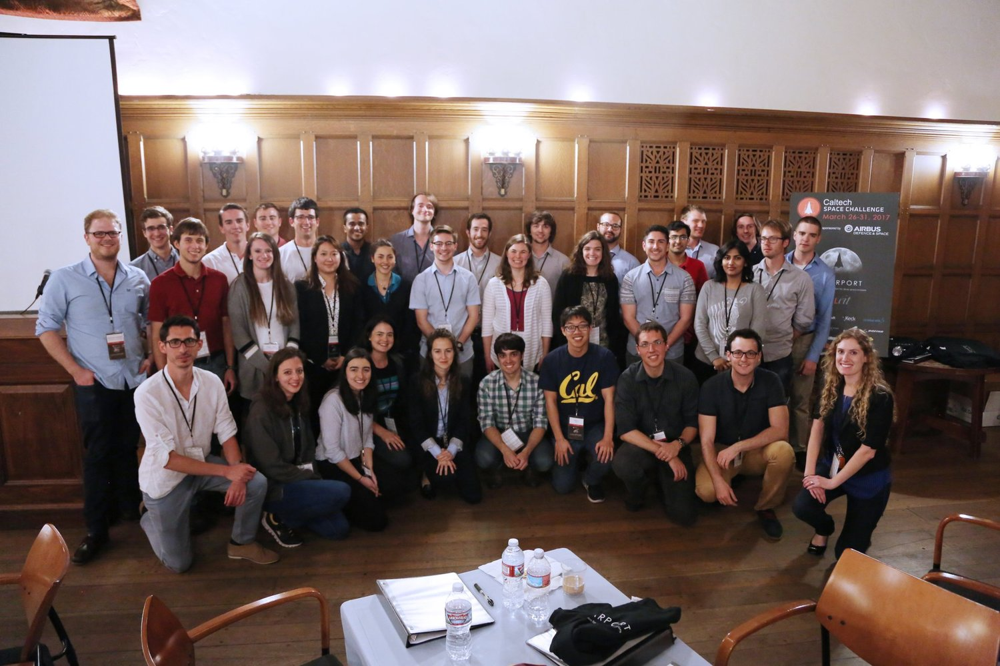

<!-- - Succesfully defended my PhD disseration this December 2019! -->
- This June 2020 my paper "Combining Visible and Infrared Spectrum Imagery using Machine Learning for Small Unmanned Aerial System Detection" was selected as the winner of the Automatic Target Recognition Best Student Paper Award during the 2020 SPIE conference!
- As of May 2020, started as Postdoctoral Researcher at U.S. Army CCDC Army Research Laboratory, Human Research and Engineering Directorate!
- Graduated from Texas A&M University with a Doctor of Philosophy in Aerospace Engineering this May 2020!
- Preprint of paper "Combining Visible and Infrared Spectrum Imagery using Machine Learning for Small Unmanned Aerial System Detection" is release on [arXiv](https://arxiv.org/abs/2003.12638) this March 2020. Please take a look at the [project page](https://sites.google.com/view/tamudrone-spie2020/) for more information. 
- Paper "Integrating Behavior Cloning and Reinforcement Learning for Improved Performance in Dense and Sparse Reward Environments" accepted this January 2020 to be presented at [AAMAS-20](https://aamas2020.conference.auckland.ac.nz/papers/).
- Defended my PhD dissertation this December 2019! Presentation available at [Dropbox](https://www.dropbox.com/s/qly3jbbl9g8qqns/Presentation_Defense_VGGoecks_final.pdf).

- Released on November 2019 the preprint "PODNet: A Neural Network for Discovery of Plannable Options" ([link](https://arxiv.org/abs/1911.00171){:target="_blank"}).
- Released on October 2019 the preprint "Integrating Behavior Cloning and Reinforcement Learning for Improved Performance in Sparse Reward Environments" ([link](https://arxiv.org/abs/1910.04281){:target="_blank"}).
- Presented on February 2019 the research work "Efficiently Combining Human Demonstrations and Interventions for Safe Training of Autonomous Systems in Real-Time" ([paper](https://arxiv.org/abs/1810.11545){:target="_blank"}), at the [AAAI-19](https://aaai.org/Conferences/AAAI-19/){:target="_blank"} (picture by [Rob Meadows](https://twitter.com/robmeadows/status/1091382352167628800){:target="_blank"}).

- Approved as PhD candidate this December 2018!
- Our hackathon team wins on September 2018 the [MD5 A-Hack-of-the-Drones 2018](https://a-hack-of-the-drones.devpost.com){:target="_blank"}. More information [here](https://engineering.tamu.edu/news/2018/11/a-team-wins-md5-a-hack-of-the-drones-2018.html){:target="_blank"}.

- Released on August 2018 the preprint "Cycle-of-Learning for Autonomous Systems from Human Interaction" ([link](https://arxiv.org/abs/1808.09572){:target="_blank"}).
- Excited to join the [Caltech Space Challenge 2017](http://csc.caltech.edu/CSC2017/first-day-of-the-challenge-the-journey-begins.html) on March 2017!

