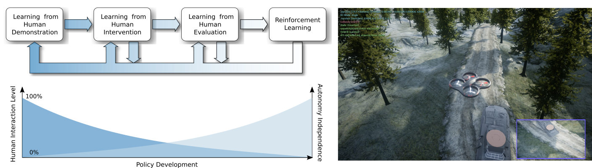
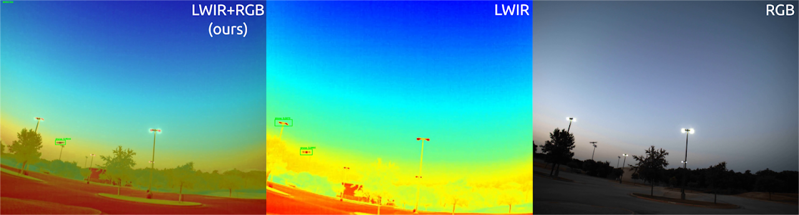
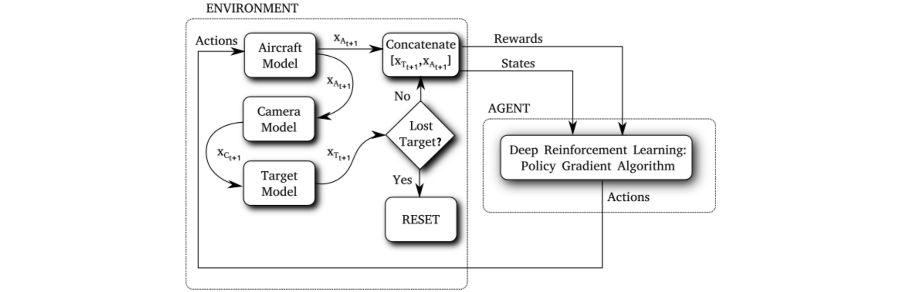
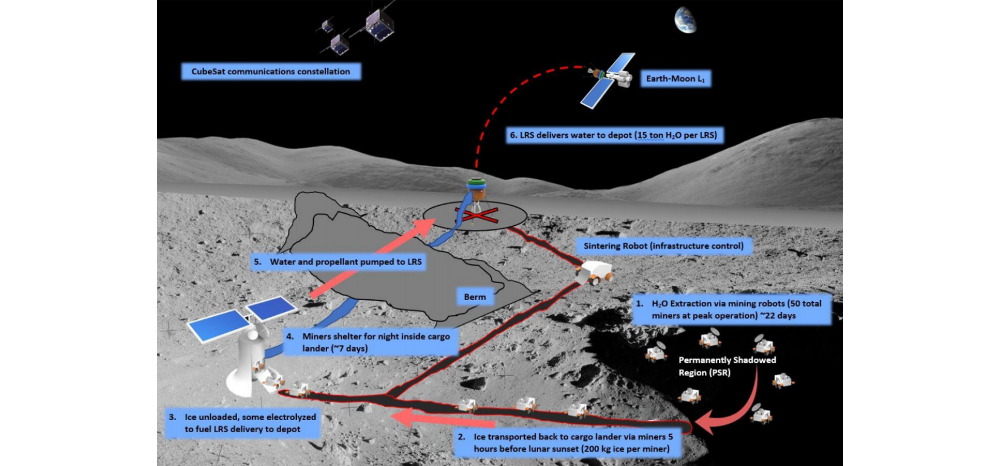
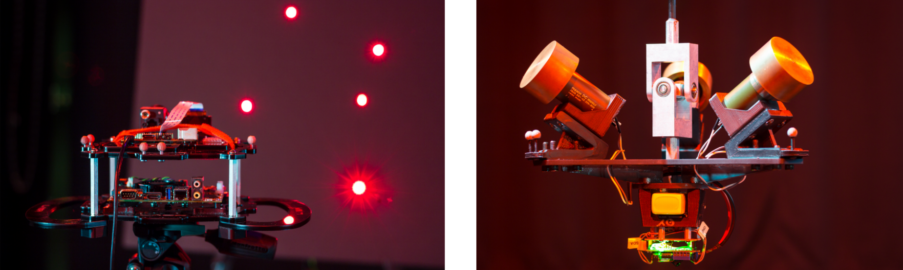
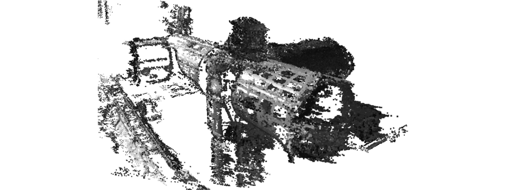

# Human-in-the-loop Machine Learning

Using human interaction to safely train autonomous systems combining supervised and reinforcement learning. 

- **Integrating Behavior Cloning and Reinforcement Learning for Improved Performance in Sparse Reward Environments**
  - [Project page](https://viniciusguigo.github.io/cycle-of-learning/)
  - [Paper](https://arxiv.org/abs/1910.04281)
  - [Summary Video]()
  - [AAMAS20 Conference Presentation (slides)](../files/CoL_AAMAS20_Presentation.pdf)
  - [AAMAS20 Conference Presentation (video)](https://youtu.be/FiHyO2pIZhA)
- **Efficiently Combining Human Demonstrations and Interventions for Safe Training of Autonomous Systems in Real-Time**
  - [Video](https://www.youtube.com/watch?v=1aktQxW7GQE)
  - [Paper](https://arxiv.org/abs/1810.11545)
- **Cycle-of-Learning for Autonomous Systems from Human Interaction**
  - [Paper](https://arxiv.org/abs/1808.09572)
- **Cyber-Human Approach For Learning Human Intention And Shape Robotic Behavior Based On Task Demonstration**
  - [Paper](https://ieeexplore.ieee.org/document/8489595)
- **PODNet: A Neural Network for Discovery of Plannable Options**
  - [Paper](https://arxiv.org/abs/1911.00171)

# Vision-based Detection of Unmanned Air Systems for Counter-UAS

This research was winner of the 2020 SPIE Automatic Target Recognition Best Student Paper Award. It combines data from RGB and long-wave infrared (LWIR) cameras to detect drones through previously difficult environments such as flying above and below the treeline/horizon, in the presence of birds, and glare from the sun. 

- **Combining Visible and Infrared Spectrum Imagery using Machine Learning for Small Unmanned Aerial System Detection**
  - [Project page](https://sites.google.com/view/tamudrone-spie2020/)
  - [Paper](https://www.spiedigitallibrary.org/conference-proceedings-of-spie/11394/2557442/Combining-visible-and-infrared-spectrum-imagery-using-machine-learning-for/10.1117/12.2557442.short)
  - [Paper (preprint)](https://arxiv.org/abs/2003.12638)
  - [News article](https://engineering.tamu.edu/news/2018/11/a-team-wins-md5-a-hack-of-the-drones-2018.html)

# Intelligent Motion Video Guidance for Unmanned Air System Ground Target Tracking

Reinforcement learning agent trained to control a real fixed-wing aircraft and perform video tracking of ground targets. 

- [Paper](https://arc.aiaa.org/doi/pdf/10.2514/6.2019-0137)
- [Video](https://youtu.be/isJtDdAiM3U)

# Enabling Deep Space Exploration with an In-Space Propellant Depot Supplied from Lunar Ice

Caltech Space Challenge 2017 (Lunarport): design a space mission to produce propellant in space by extracting lunar resources and enable deep space missions.

- [Paper](https://arc.aiaa.org/doi/pdf/10.2514/6.2017-5376)
- [Challenge information](https://csc.caltech.edu/CSC2017/pages/participants.html)

# Low-cost Satellite Attitude Control and Estimation Testbed (LAT)

Custom 3-DoF experimental attitude platform for testing attitude control and estimation algorithms.

- [Paper](https://pdfs.semanticscholar.org/7b06/d263ca06911dbca0172f7641d606dd07faa5.pdf)
- [Video](https://www.youtube.com/watch?v=pO9eCf5VcRc)

# Computer Vision Aided Robotic Operations on the International Space Station

Development of a real-time, video-based, stereo reconstruction of large-scale environments to support robotics operations.

- [Paper](https://arc.aiaa.org/doi/pdf/10.2514/6.2017-0883)
- [Video](https://www.youtube.com/watch?v=lPiscexOUls)

# Space Robotics: Holonomic Omni directional Motion Emulation Robot (HOMER)

Assembling and testing a second HOMER unit for testing space proximity operation experiments.

- [Video](https://www.youtube.com/watch?v=U3FQ1rvBtt0)

# The 2011 IEEE International Future Energy Challenge  (IFEC'11)

Design and implementation of the Tri-State Boost Current Source Inverter (CSI), awarded the IES Best Innovative Design of Power Electronic Converters during the IFEC'11.

- [Challenge information](https://energychallenge.weebly.com/ifec-2011.html)
