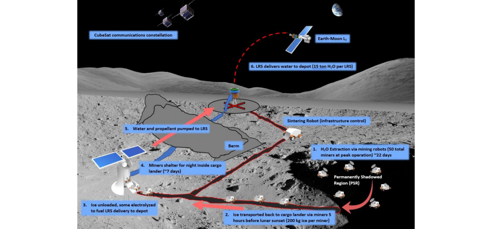
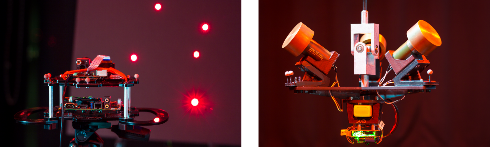
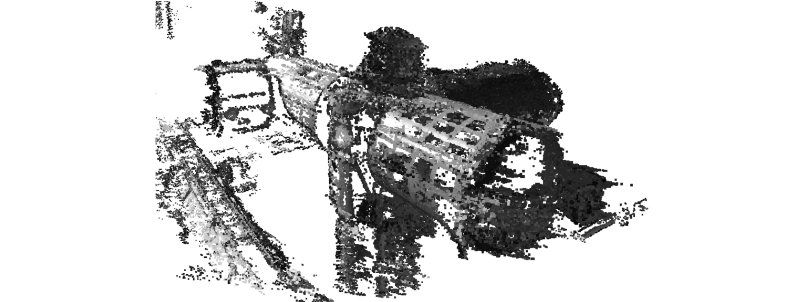

# Space Robotics and Power Electronics
<!-- - LAT/HOMER
- ISS Vision
- Caltech Challenge
- SysID DFTI
- IEEE -->

## Enabling Deep Space Exploration with an In-Space Propellant Depot Supplied from Lunar Ice

Caltech Space Challenge 2017 (Lunarport): design a space mission to produce propellant in space by extracting lunar resources and enable deep space missions.

- [Paper](https://arc.aiaa.org/doi/pdf/10.2514/6.2017-5376)
- [Challenge information](https://csc.caltech.edu/CSC2017/pages/participants.html)

## Low-cost Satellite Attitude Control and Estimation Testbed (LAT)

Custom 3-DoF experimental attitude platform for testing attitude control and estimation algorithms.

- [Paper](https://pdfs.semanticscholar.org/7b06/d263ca06911dbca0172f7641d606dd07faa5.pdf)
- [Video](https://www.youtube.com/watch?v=pO9eCf5VcRc)

## Computer Vision Aided Robotic Operations on the International Space Station

Development of a real-time, video-based, stereo reconstruction of large-scale environments to support robotics operations.

- [Paper](https://arc.aiaa.org/doi/pdf/10.2514/6.2017-0883)
- [Video](https://www.youtube.com/watch?v=lPiscexOUls)

## Space Robotics: Holonomic Omni directional Motion Emulation Robot (HOMER)

Assembling and testing a second HOMER unit for testing space proximity operation experiments.

- [Video](https://www.youtube.com/watch?v=U3FQ1rvBtt0)

## The 2011 IEEE International Future Energy Challenge  (IFEC'11)

Design and implementation of the Tri-State Boost Current Source Inverter (CSI), awarded the IES Best Innovative Design of Power Electronic Converters during the IFEC'11.

- [Challenge information](https://energychallenge.weebly.com/ifec-2011.html)